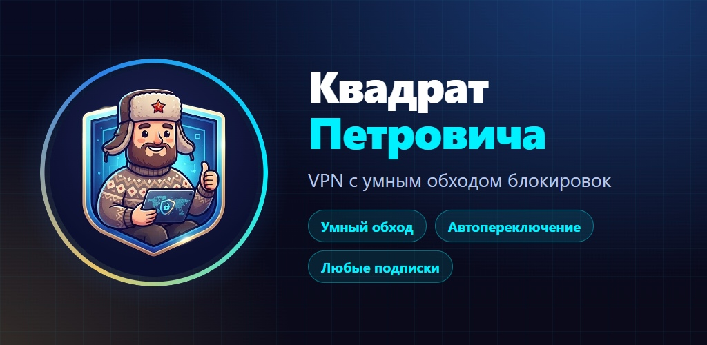
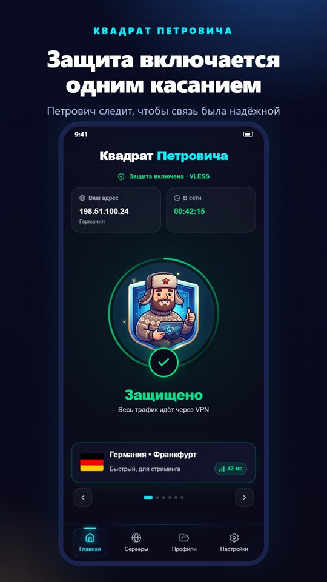
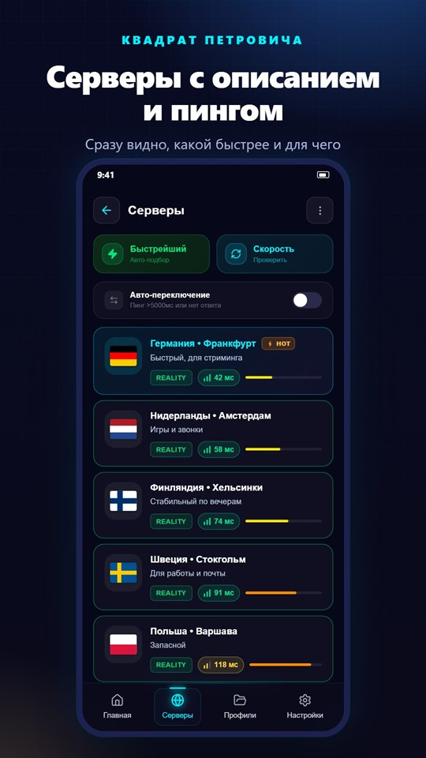
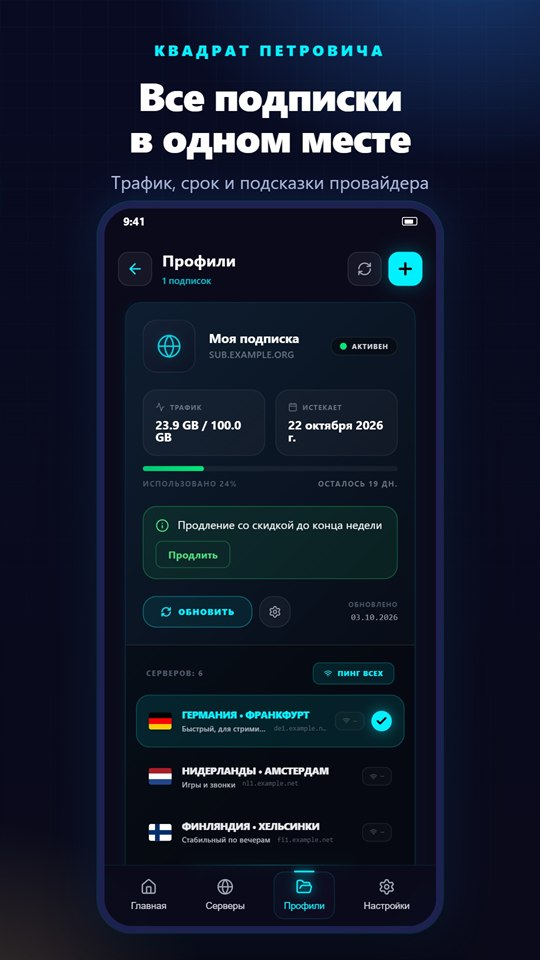
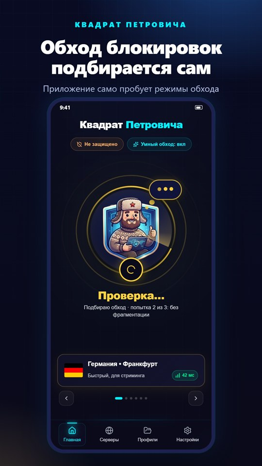
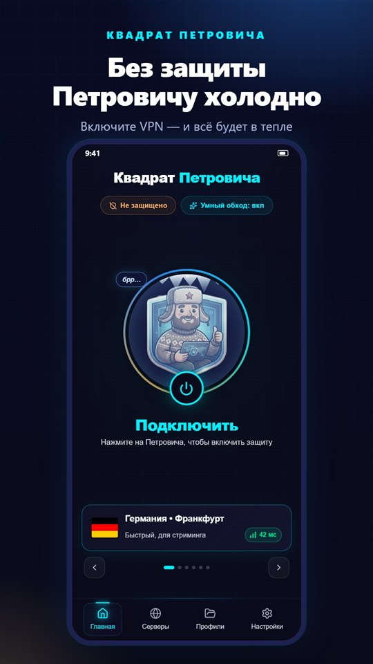

<div align="center">


# Квадрат Петровича

**VPN-клиент с умным обходом блокировок для Android и Windows**  
Обходит DPI и белые списки — там, где другие клиенты не работают

<br/>

[](https://github.com/sim-proxy-online/vpn_app/releases/download/v2.8.2/KvadratPetrovicha-v2.8.2.apk)
[](https://github.com/sim-proxy-online/vpn_app/releases/download/v2.7.0/KvadratPetrovicha-Setup-2.7.0.exe)
[](https://github.com/sim-proxy-online/vpn_app/releases/download/v2.7.0/KvadratPetrovicha-2.7.0-portable.exe)

<br/>



</div>

---

## Скриншоты

<table>
  <tr>
    <td align="center"></td>
    <td align="center"></td>
    <td align="center"></td>
    <td align="center"></td>
    <td align="center"></td>
  </tr>
  <tr>
    <td align="center"><sub>Защита<br/>одним касанием</sub></td>
    <td align="center"><sub>Серверы с описанием<br/>и пингом</sub></td>
    <td align="center"><sub>Все подписки<br/>в одном месте</sub></td>
    <td align="center"><sub>Обход подбирается<br/>сам</sub></td>
    <td align="center"><sub>Без защиты<br/>Петровичу холодно</sub></td>
  </tr>
</table>

---

## О приложении

**Квадрат Петровича** — клиент на базе [Xray-core](https://github.com/XTLS/Xray-core) и [mihomo](https://github.com/MetaCubeX/mihomo) с поддержкой 17+ протоколов. Специально оптимизирован для работы в России и других странах с жёстким DPI: фрагментация TLS ClientHello, шумовой трафик и умная система пресетов позволяют подключаться там, где обычные клиенты показывают -1.

Приложение работает с подписками **любых провайдеров**, а не только с нашей. Получить подписку: [petrovich.party](https://petrovich.party). Страница приложения со скачиванием и ответами на вопросы: [app.petrovich.party](https://app.petrovich.party).

---

## Возможности

### Протоколы
VLESS · VMess · Trojan · Shadowsocks · Hysteria2 · TUIC · WireGuard · REALITY · ShadowTLS · AnyTLS · SOCKS · HTTP · SSH · Brook · Naive · XHTTPv2

### Подписки и серверы
- Импорт по ссылке, QR-коду (камера + галерея), из буфера обмена, из файла `.txt/.json/.yaml`
- Массовая вставка списка серверов
- Deep link `sim://` и `happ://` — открывается прямо из браузера
- **Автоопределение панелей:** Remnawave, Marzban/Marzneshin, 3x-ui, Hiddify
- Авто-обновление подписок по расписанию
- Отображение трафика, даты истечения и статуса подписки
- **Описание сервера** под названием, цветная таблетка пинга («42 мс»), большой флаг страны

### Совместимость с Happ
Приложение понимает [параметры управления Happ](https://www.happ.su/main/ru/dev-docs/app-management), которые провайдер отдаёт вместе с подпиской:
- описание сервера, фирменный цвет профиля, порядок и закрепление профилей, свёрнутые/развёрнутые списки;
- автоподключение к нужному серверу, обновление и пинг при открытии, предупреждения об окончании подписки;
- раздельное туннелирование по приложениям, исключение маршрутов, свой User-Agent, скрытие настроек.

Параметры применяются только для проверенных провайдеров, пробного профиля и подписок, которые вы подтвердили сами. Небезопасные параметры (свои туннельные конфиги, учётные данные прокси) не применяются никогда.

### Обход блокировок
- **Автоподбор обхода** — приложение само пробует режимы обхода, пока не найдёт рабочий
- **Авто-пресет по оператору** — определяет МТС / Мегафон / Теле2 / Ростелеком / Билайн и применяет нужные настройки DPI автоматически при запуске
- **Фрагментация TLS** — разбивает ClientHello на части, обходя DPI и белые списки
- **Шумовой трафик (Noises)** — дополнительная обфускация соединения
- Пресеты: `МТС · Мегафон · Теле2` / `Ростелеком · Дом.ру` / `YouTube / Instagram` / `Максимум`

### Подключение и маршрутизация
- **Авто-выбор лучшего сервера** — пинг всех узлов и подключение к быстрейшему
- **Умная маршрутизация:** Глобально · Обход RU · Только заблокированное · Обход локальных
- **Split-tunnel по приложениям** — выбираешь какие приложения идут через VPN
- Прямой доступ к российским банкам и сервисам (Госуслуги, Сбер, Тинькофф, ВТБ и др.)
- Пользовательские правила маршрутизации (домены, IP, geoIP)
- Блокировка рекламы

### Стабильность
- **Авто-реконнект** при смене сети (Wi-Fi ↔ мобильная)
- **Kill Switch** — блокирует трафик при обрыве VPN
- Watchdog — обнаруживает зависание трафика и переподключается
- **Авто-переключение** на другой сервер при деградации

### Безопасность и диагностика
- Плитка **«Ваш адрес»** — реальный внешний IP и страна при включённом VPN
- Авто-тест IP и DNS-утечек при подключении
- Speed Test — замер реальной скорости через сервер
- Мониторинг качества соединения (задержка, потери, jitter)
- **DoH / Fake DNS** — защита DNS-запросов
- Хосты-маппинг, выбор первичного/резервного DNS

### Интерфейс
- Тёмный неоновый UI с выбором цвета акцента
- **Петрович меняет настроение** по состоянию подключения, на пустых экранах — рисунки
- Dashboard: графики трафика, история, карта серверов
- Виджет скорости ↑/↓ в шторке уведомлений (Android)
- Русский и английский интерфейс
- Онбординг для новых пользователей

### Данные и экспорт
- Резервная копия всех профилей и настроек одним файлом
- Опциональное шифрование бэкапа (AES-256)
- **Авто-обновление приложения** через GitHub Releases

---

## Что нового в 2.8.2

Мобильные операторы в России (МТС, Мегафон и другие) начали активнее резать соединения: часть серверов из подписки перестала открываться, а обновление подписки возвращало список без резервных маршрутов. В этой версии —

- **Ядро обновлено до свежего Xray-core** (сентябрьская версия) — переписан модуль TUN/UDP, через который проходит весь трафик телефона. Это устраняет зависания и обрывы соединения, особенно на мобильной сети.
- **Восстановлено корректное обновление подписки** — приложение снова получает от провайдера полные конфигурации с балансировщиками и резервными маршрутами. Раньше часть запросов уходила с неизвестным User-Agent, и сервер отдавал урезанный список без запасных серверов.
- **Исправлено падение при ручном отключении** — если нажать «Отключить» во время фоновой проверки соединения, приложение больше не завершается с ошибкой.
- **Стабильность при смене сети** — туннель корректно переподключается при переключении Wi-Fi ↔ мобильная смена и в авиарежиме.

Полный список версий и файлы — на странице [Releases](https://github.com/sim-proxy-online/vpn_app/releases).

---

## Установка

### Android
1. Скачайте [`KvadratPetrovicha-v2.8.2.apk`](https://github.com/sim-proxy-online/vpn_app/releases/download/v2.8.2/KvadratPetrovicha-v2.8.2.apk)
2. Откройте файл на устройстве → разрешите установку из неизвестных источников
3. Добавьте подписку (ссылка / QR / буфер обмена) и нажмите на Петровича

> Требования: Android 7.0+ (API 24), arm64 или arm32

### Windows
| Вариант | Ссылка | Описание |
|---|---|---|
| Установщик | [KvadratPetrovicha-Setup-2.7.0.exe](https://github.com/sim-proxy-online/vpn_app/releases/download/v2.7.0/KvadratPetrovicha-Setup-2.7.0.exe) | Устанавливает в профиль пользователя, без прав администратора |
| Portable | [KvadratPetrovicha-2.7.0-portable.exe](https://github.com/sim-proxy-online/vpn_app/releases/download/v2.7.0/KvadratPetrovicha-2.7.0-portable.exe) | Запускается без установки |

> Требования: Windows 10+ x64

### Если у вас был Sim Proxy
«Квадрат Петровича» — **новое приложение**: оно ставится рядом со старым Sim Proxy, а не поверх него. Чтобы перенести подписки и настройки:
1. В старом Sim Proxy: **Настройки → резервная копия (экспорт)** — сохраните файл.
2. В «Квадрат Петровича»: **Настройки → «Восстановить из бэкапа»** — выберите этот файл.

Или просто добавьте подписку заново по ссылке.

Все версии и список изменений — на странице [Releases](https://github.com/sim-proxy-online/vpn_app/releases).

---

## Deep links

Открываются прямо из браузера (схемы `sim://` и `happ://`):

| Ссылка | Действие |
|---|---|
| `sim://import/<url>` | импорт подписки или сервера |
| `sim://add/<url>` · `sim://subscribe/<url>` | импорт подписки |
| `sim://routing/add/<base64>` | импорт профиля маршрутизации |

Протокольные ссылки `vless://` `vmess://` `trojan://` `ss://` `hysteria2://` `tuic://` `wireguard://` — вставляются из буфера обмена.

---

## Сборка из исходников

**Android:**
```bash
npm install
npm run build                          # Vite → dist/index.html
cd android && ./gradlew assembleRelease
# APK: android/app/build/outputs/apk/release/app-release.apk
```

**Windows:**
```powershell
npm install
npm run electron:build
# Артефакты: desktop/dist-exe/
```

**Стек:** React 19 + Vite + TailwindCSS + Capacitor (Android) · Electron (Windows) · Xray-core · Mihomo (Clash.Meta) · tun2socks

---

## Конфиденциальность

Какие данные хранятся на устройстве и к каким сервисам обращается приложение — в [политике конфиденциальности](https://app.petrovich.party/privacy-policy.html).

---

## Дисклеймер

Приложение предназначено для законного использования: приватность, доступ к сервисам и обход цензуры там, где это разрешено. Подписку на прокси-серверы пользователь предоставляет самостоятельно.
